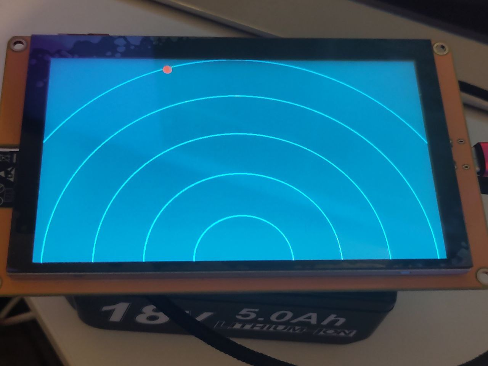

# ESP32 Heartbeat Sensor

 Call Of Duty's "heartbeat sensor" effect with an ESP32 LCD module and a LD2450 mmWave radar module

 Radar driver: https://github.com/Kezii/LD24xx
 
 LCD module driver: https://github.com/Kezii/rust_ESP32-8048S050

 ## Photo

 

